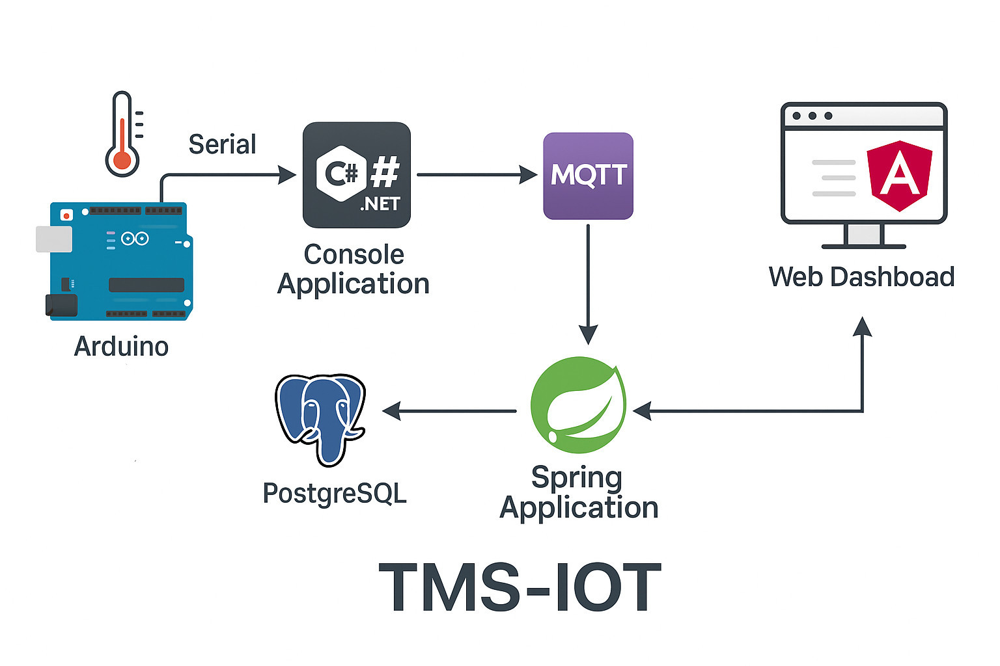

# tms-iot

### **TMS-IOT – Temperature Monitoring System using IoT Architecture**

The **TMS-IOT** system is designed to monitor temperature data using an end-to-end IoT pipeline. Here's how the system works:

  

1. **Arduino with Temperature Sensor**
   A temperature sensor connected to an Arduino collects real-time environmental data. The Arduino transmits this data via a **serial connection** to a local application.

2. **Console Application (.NET C#)**
   A C# console application reads the serial data from the Arduino. It processes and forwards the readings to an **MQTT Broker** using a public topic.

3. **MQTT Broker**
   The MQTT Broker acts as a lightweight messaging intermediary. It publishes the temperature data, making it available to any subscribed services.

4. **Spring Application (Java)**
   A Spring Boot application subscribes to the MQTT topic, receives the temperature data, and processes it. The application stores the data in a **PostgreSQL** database and makes it available through RESTful endpoints.

5. **PostgreSQL Database**
   This relational database persistently stores all temperature readings, enabling historical data analysis, reporting, and dashboard visualization.

6. **Web Dashboard (Angular)**
   The Angular frontend consumes data from the Spring Application via HTTP requests. It displays the temperature information in a user-friendly interface with real-time updates and visual charts.
